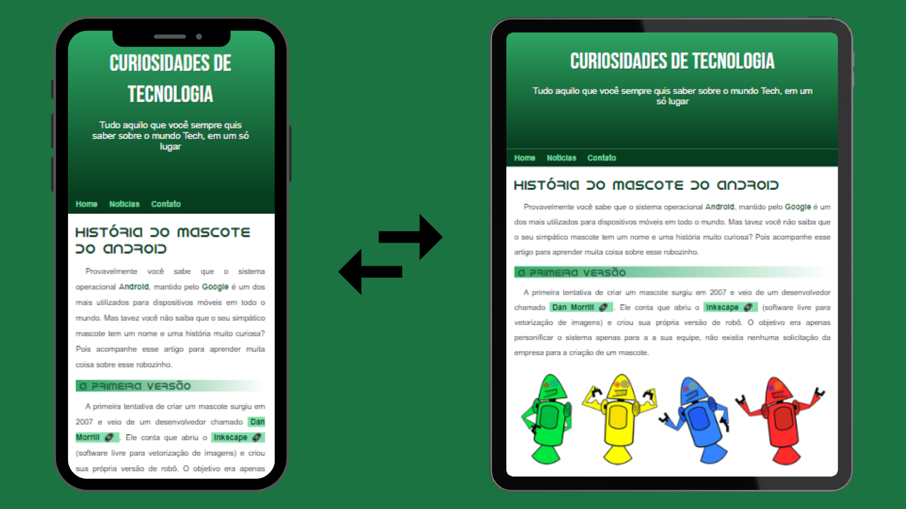
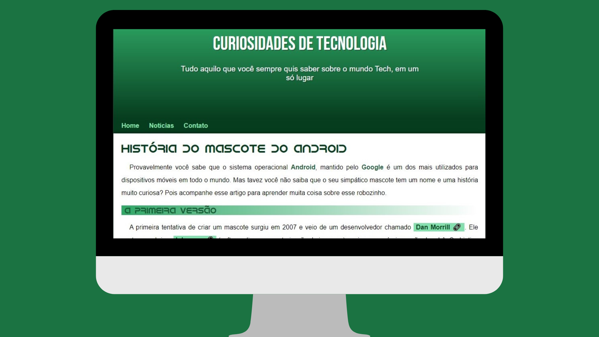

# Projeto Android

## Blog Curiosidades de Tecnologia

Este é um blog sobre curiosidades de tecnologia, no qual eu abordei sobre a história do mascccote android. Quando surgiu, Quem o criou são alguns dos temas abordados no blog.

<a href="https://joselucas77.github.io/projeto-android/" target="_blank">🔗 Acesse aqui o projeto</a>

## Tecnologias ultilizadas e informações adicionais

- HTML e CSS
- Site Responsivo
